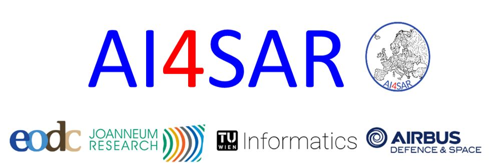

# Tutorials

<!-- # AI4SAR data access -->

    

      
    

    

      <strong>AI4SAR data access</strong> 
      This notebook demonstrates how to access and visualize AI4SAR Sigma0 (VV and VH) SAR data via a STAC API. It covers searching and filtering collections, loading data into xarray using odc.stac, reprojecting to custom or original CRS, and displaying scaled grayscale images for selected scenes.
      

         AI4SARSigma0STAC
      

      <a href="AI4SAR_access_data.ipynb" style="text-decoration: none; color: #1d70b8; font-weight: bold;">View Notebook</a>
    

  

<!-- Demo Argo Workflow - Submit Custom -->

    

      
    

    

      <strong>Demo Argo Workflow - Submit Custom</strong> 
      This notebook demonstrates how to configure and interact with an Argo Workflow service using the eodc SDK. It shows how to set up service credentials, define custom workflows in code using Hera, submit them to the Argo server, and retrieve workflow logs for monitoring.
      

         Argo Workfloweodc SDKHera
      

      <a href="eodc_sdk_argo.ipynb" style="text-decoration: none; color: #1d70b8; font-weight: bold;">View Notebook</a>
    

  

<!-- Access Austrian Ground Motion data via OGC API - Features (WFS) -->

    

      
    

    

      <strong>Access Austrian Ground Motion data via OGC API - Features (WFS)</strong> 
      This notebook shows how the Ground Motion data over Austria can be loaded from the EODC OGC API and how to visualize it.
      

         WFSOGC API
      

      <a href="Ground_Motion_WFS.ipynb" style="text-decoration: none; color: #1d70b8; font-weight: bold;">View Notebook</a>
    

  

<!-- Connect to OGC API - Features service -->

    

      
    

    

      <strong>Connect to OGC API - Features service</strong> 
      This notebook demonstrates how to access and query YIPEEO vector data exposed through the OGC API - Features service. It shows how to list public collections, authenticate with EODC credentials to access protected datasets, filter and query features , and visualize the results in a GeoDataFrame with maps.
      

         OGC APIYIPEEOAuthentication
      

      <a href="read_yipeeo_data.ipynb" style="text-decoration: none; color: #1d70b8; font-weight: bold;">View Notebook</a>
    

  

  <!-- Harmonized Landsat and Sentinel-2 L2F Analysis -->

    

      
    

    

      <strong>Harmonized Landsat and Sentinel-2 L2F Analysis</strong> 
      This notebook demonstrates how to search, load, and visualize Harmonized Landsat 8 and Sentinel-2 L2F (Level 2F) data using STAC and the ODC ecosystem. We query the EO Data Cube STAC API, retrieve scenes for a given spatial and temporal extent, and work with data subsets using xarray and dask for efficient handling of large datasets.
      

         Sentinel-2Landsat 8STACOGC API
      

      <a href="sen2like.ipynb" style="text-decoration: none; color: #1d70b8; font-weight: bold;">View Notebook</a>
    

  

  <!-- Harmonized Landsat and Sentinel-2 L2F Analysis - NDVI computation -->

    

      
    

    

      <strong>Harmonized Landsat and Sentinel-2 L2F Analysis - NDVI computation</strong> 
      This notebook demonstrates how to search and access Harmonized Landsat and Sentinel-2 L2F data via the EODC STAC API. It shows how to load spectral bands with odc.stac, compute NDVI from red (B04) and NIR (B08) bands using Dask for scalable processing, and visualize the results with matplotlib.
      

         Sentinel-2Landsat 8STACNDVI
      

      <a href="sen2like-ndvi.ipynb" style="text-decoration: none; color: #1d70b8; font-weight: bold;">View Notebook</a>
    

  

  <!-- Reading Sentinel-2 L2A Data from a Remote STAC Catalog -->

    

      
    

    

      <strong>Reading Sentinel-2 L2A Data from a Remote STAC Catalog</strong> 
      This notebook illustrates how to query and access Sentinel-2 L2A data from Microsoft’s Planetary Computer STAC catalog. It applies spatial, temporal, and quality filters, selects the least cloudy scene, retrieves a visual asset, and uses Rasterio and PIL to crop, warp, and display the image over a defined area of interest.
      

         Sentinel-2Planetary ComputerSTAC
      

      <a href="Sentinel-2.ipynb" style="text-decoration: none; color: #1d70b8; font-weight: bold;">View Notebook</a>
    

  

  <!-- Wetland Extent Monitoring with Sentinel-1 SAR -->

    

      
    

    

      <strong>Wetland Extent Monitoring with Sentinel-1 SAR</strong> 
      This notebook shows how to access and visualize wetland extent datasets derived from Sentinel-1 SAR via a STAC API. It demonstrates downloading open-water and inundated-vegetation products, stacking them into time series with xarray, and interactively exploring wetland dynamics through temporal visualization using ipywidgets.
      

         Sentinel-1SARSTAC
      

      <a href="wetland-explorer.ipynb" style="text-decoration: none; color: #1d70b8; font-weight: bold;">View Notebook</a>
    

  

